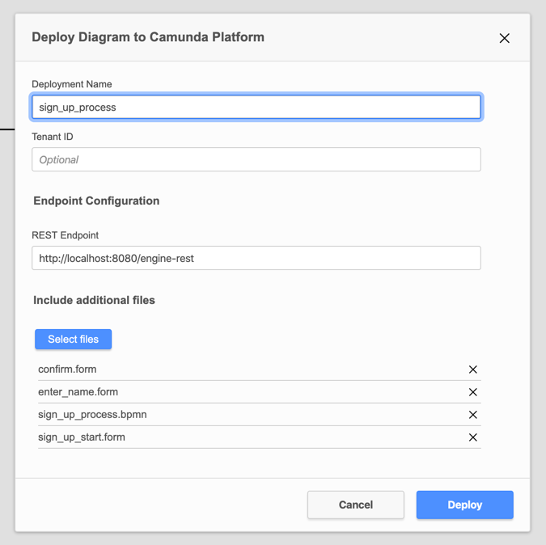

# camunda-7.15-form-test
Testing the new Camunda 7.15 Forms

# Run
Clone repo
```
git clone https://github.com/herr-vogel/camunda-7.15-form-test.git camunda-7.15-form-test
```
Download latest Camunda Modeler [here](https://camunda.com/de/download/modeler/)

Run Camunda via Docker
```
docker pull camunda/camunda-bpm-platform:7.15.0
docker run -d --name camunda -p 8080:8080 camunda/camunda-bpm-platform:7.15.0
```

Deploy files



Start Process in Tasklist
